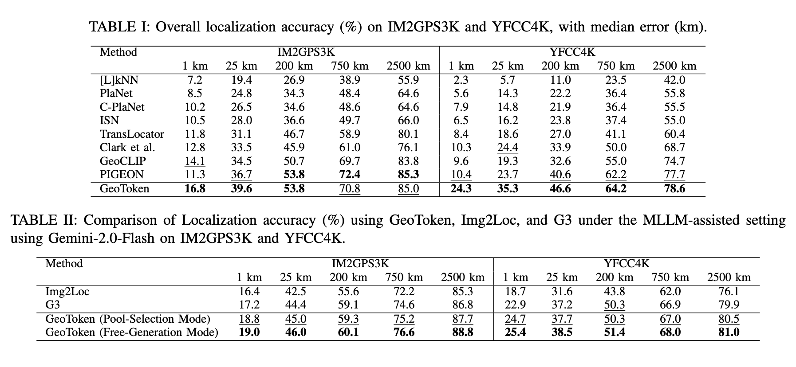

# GeoToken

Official code repository for "GeoToken: Hierarchical Geolocalization of Images via Next Token Prediction" [ICDM 2025].

GeoToken is a framework for geographic localization using transformer models with multimodal inputs and retrieval-augmented generation.

> **Note**: This repository is being actively updated. Additional components and documentation will be added soon.

## Pipeline

### 1. Contrastive Learning with CLIP

Will be updated.

### 2. Data Indexing for RAG

Will be updated.

### 3. Transformer Training

Train the transformer model that integrates the indexed data for geographic token prediction:

```bash
python train_transformer_c_n_grouped.py
```

## Inference Options

GeoToken offers multiple inference strategies:

### Standard Sampling

Generate location predictions using standard sampling with temperature from the decoder:

```bash
python sample_n.py
```

### Beam Search

Use beam search for location predictions:

```bash
python beam_search.py
```

### MLLM-Assisted Geolocalization

Leverage Gemini multimodal LLM to analyze the image and refine predictions using model samples as context:

```bash
python ask_gemini_sample_neighbor.py
```

This approach combines visual understanding from Gemini with the transformer's candidate predictions to determine the most accurate location.

The results obtained from the code is presented here:


